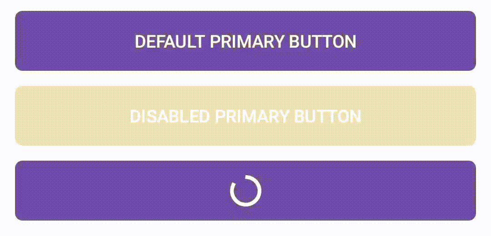
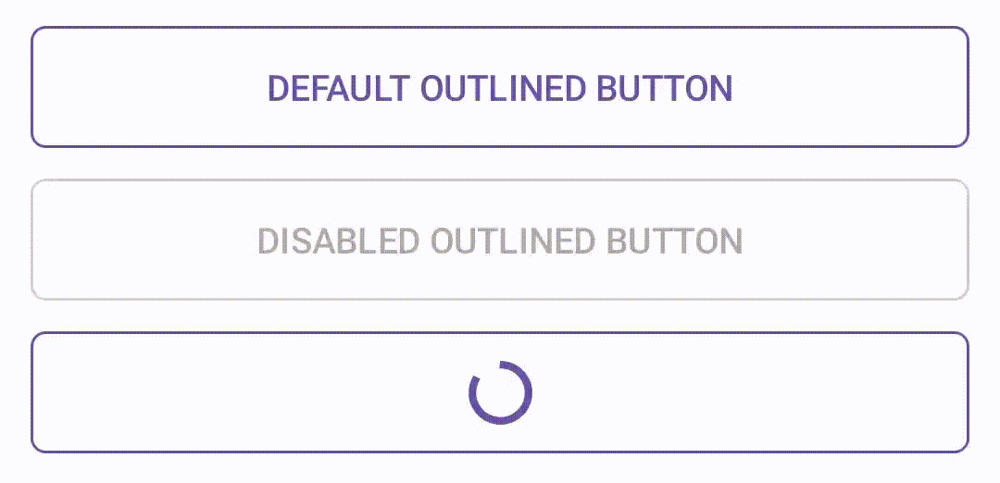

[](https://github.com/ThomasBernard03/Composents/actions/workflows/main.yml)
[](https://jitpack.io/#ThomasBernard03/Composents)


##

In settings.gradle.kts add jitpack repository :
```kotlin
repositories {
    google()
    mavenCentral()
    maven { url = uri("https://jitpack.io" ) } // This line
}
```

Then you can add dependency :
```kotlin
implementation("com.github.ThomasBernard03:Composents:version")
```


# Components 


## Buttons 


### PrimaryButton

 
```kotlin
fun PrimaryButton(
    text : String,
    modifier: Modifier = Modifier,
    enabled: Boolean = true,
    loading : Boolean = false,
    onClick: () -> Unit
){}
```

### OutlinedButton


```kotlin
@Composable
fun OutlinedButton(
    text: String,
    modifier : Modifier = Modifier,
    enabled : Boolean = true,
    loading : Boolean = false,
    color : Color = MaterialTheme.colorScheme.primary,
    onClick: () -> Unit
){}
```


## Navigation

animatedComposable is an extension method of NavGraphBuilder. It can be used like this : 
```kotlin
NavHost(navController = navController, startDestination = "home"){
    animatedComposable("home"){
        HomeScreen()
    }
    animatedComposable("buttons"){
        ButtonsScreen()
    }
}
```

Slow motion demonstration :

